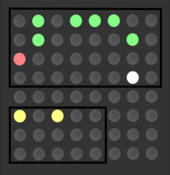

# Sense-Hat-Activity-Checkin
## Introduction
- This is a light dashborad to checkin the daily goal which you want to monitor/record.
- The dashboard is easy to use and can be highly customized base on your use case.
- Data is stored in `./data/record.csv`, there is a sample file provided with this project.

## Requirements
To make this run, you have to:
- Install Raspbian on your Raspberry Pi
- Have your Sense Hat installed on the Raspberry Pi mother board, make sure the joystick and LED matrix are in good condition.
- Have all required python package installed

## How to use:
### 1. The 8*8 LET matrix on Sense Hat
   
The img above shows what the dashboard looks like. The two functional areas are highlighted by black squares:  
#### The upper area is for checkin purpose
- **White light** marks the **last day** of the month.
- **Red light** marks the **current day**. And this red light will blink to another color which marks the actual current checkin status.
  - For example, if today's activity **A** hasn't been checkedin, then this pixel will blink between **red** and **no light**;
  - If checkedin, it would blink between **red** and **green**
- All **green pixels** are the past checkin status, while no light means no checkin record on that date.

#### The lower area shows which month in a year that the current diaplayed dashboard is from
- This is a **3*5 matrix**, since we have 12 months, I use the **first column** to represent the **10**, use the **2-5 columns** to represent **month 1-9**.
  - In the example img, what the month matrix shows is **November**. 

### 2. What you can do with the joystick
The dashboard has two dimensions: **time** and **activities**, which means you can log different activities, and can see all the past records for each single activity.
#### The Joystick can be operated in these ways to trigger different actions:
##### a. push up then release (quick): 
- go to the previous month's dashboard for the current activity.
##### b. push down then release (quick): 
- go to the next month's dashboard for the current activity.
##### c. push right then release (quick): 
- switch to next activity's dashboard from the current displayed month.
##### d: push left then release (quick): 
- switch to previous activity's dashboard from the current displayed month.
##### e: push the middle button then release (quick):
- checkin / remove checkin
##### f: push down and hold for 3 seconds, then release: 
- go back to the current month's dashboard of the current activity.
##### g: push the middle button and press for 3 seconds, then release: 
- close the dashboard / awake the dashboard.

**When switching between different activities, you will see the title of the current activitiy before you see the dashboard:**  

### 3. Customize it!
In this project, a lot of things can be customized to satisfiy your requirements:
#### 1) Light color:
- Modify the RGB colors in `settings.py`
#### 2) Rotation:
- Base on the direction you place your Sense Hat LED matrix, differnt rotation settings need to be done in order to make your dashboard looks good
- Modify the rotation in `Display.py`, line 7
#### 3) Activities
- A sample `data/record.csv` is provided with the project, feel free to modify the column name / add more columns to let you able to track more activities in this app.

